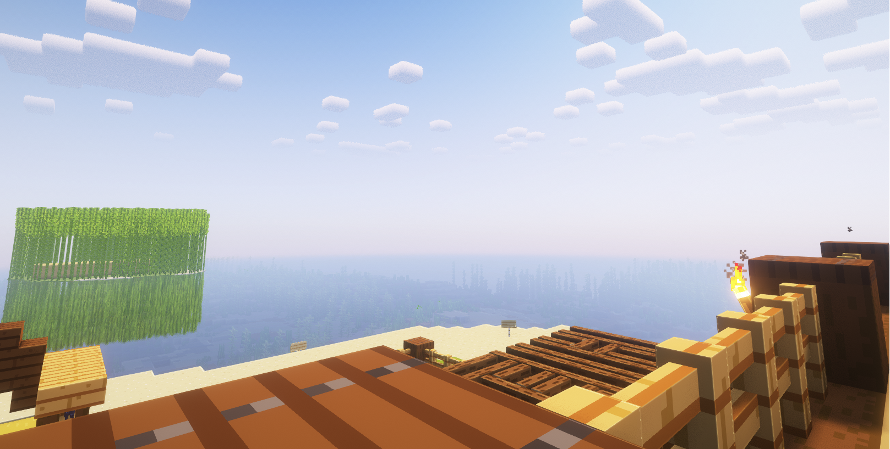

{.rounded}

# Команды сервера

## Основные команды

| Команда                                                     | Что делает                                                         |
| ----------------------------------------------------------- | ------------------------------------------------------------------ |
| **/reg, /register**                                         | Зарегистрировать аккаунт                                           |
| **/l, /login**                                              | Войти в аккаунт                                                    |
| **/changepassword**                                         | Сменить пароль от аккаунта                                         |
| **/premium**                                                | Подключить премиум аккаунт (Только для лицензии)                   |
| **/skin**                                                   | Сменить скин                                                       |
| **/disc**                                                   | Записать музыку на пластинку                                       |
| **/lay**                                                    | Лечь                                                               |
| **/crawl**                                                  | Ползти                                                             |
| **/sit**                                                    | Сесть                                                              |
| **/msg**                                                    | Отправить личное сообщение игроку                                  |
| **/me**                                                     | Отыгровка RP                                                       |
| **/do**                                                     | Описание событий и ситуаций                                        |
| **/try**                                                    | Удачный/неудачный исход событий                                    |
| **/gme**                                                    |                                                                    |
| _**/roll (временно отключено)**_                            | _Выпадение случайного числа из диапазона_                          |
| **/whisper**                                                | Прошептать игроку                                                  |
| **/coin**                                                   | Подбросить монетку                                                 |
| **/dice**                                                   | Бросить кубик                                                      |
| **/ichat \[inv, ender, item, pos, ping] <любое сообщение>** | Показать координаты, эндер сундук, предмет, инвентарь, пинг в чате |
| **/playtime**                                               | Посмотреть наигранное время на сервере                             |
