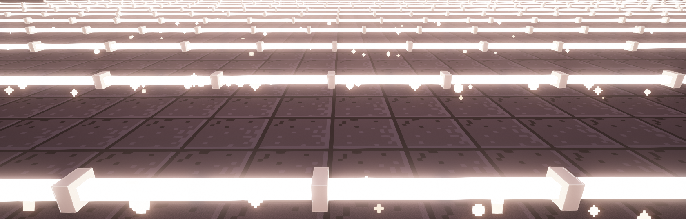
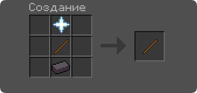

{.rounded}

# Кастомные крафты

  
  <figure style="margin: 10px; width: 250px;">
    
    <figcaption style="display: flex; flex-direction: column; text-align: center;">
      
Крафт <strong style="color:#ef4444;">Мешочка</strong>

    </figcaption>
  </figure>

  <figure style="margin: 10px; width: 250px;">
    
    <figcaption style="display: flex; flex-direction: column; text-align: center;">
      
Крафт <strong style="color:#ef4444;">Невидимой рамки</strong>

    </figcaption>
  </figure>

  <figure style="margin: 10px; width: 250px;">
    
    <figcaption style="display: flex; flex-direction: column; text-align: center;">
      
Крафт <strong style="color:#ef4444;">Дебаг палочки</strong>

    </figcaption>
  </figure>

  <figure style="margin: 10px; width: 250px;">
    
    <figcaption style="display: flex; flex-direction: column; text-align: center;">
      
Крафт <strong style="color:#ef4444;">Света</strong>

    </figcaption>
  </figure>

