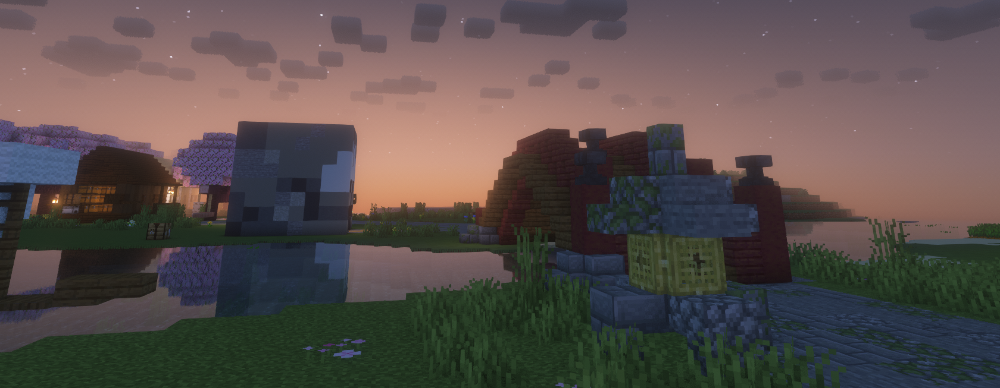
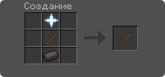

{.rounded}

# Дебаг палочка

## Крафт палочки

Крафт Дебаг палочки довольно сложный, но игрокам которые уже хорошо развились он покажется лёгким

    
    
Одна звезда незера, одна палочка, один незер слиток

## Режимы дебаг палочки

* Чтобы поменять режим нажимайте: **F**
  * Классический режим:
    * Работает как обычная дебаг палочка:
    * **ПКМ** чтобы выбрать данные для изменения,
    * **ЛКМ** чтобы изменить данное значение.
  * Режим копирования:
    * **ПКМ** чтобы скопировать данные блока,
    * **ЛКМ** чтобы вставить скопированные данные.
  * Режим заморозки:
    * **ПКМ** чтобы заморозить или разморозить блок,
    * **ЛКМ** чтобы разморозить все блоки.
    * **Замороженные блоки** нельзя изменять.

* #### Блоки которые нельзя замораживать

Открой меня

* CHEST
* TRAPPED\_CHEST
* BARREL
* FURNACE
* DISPENSER
* DROPPER
* SHULKER\_BOX
* BLAST\_FURNACE
* SMOKER
* HOPPER
* JUKEBOX
* SPAWNER
* BREWING\_STAND
* DECORATED\_POT
* CHISELED\_BOOKSHELF
* END\_PORTAL\_FRAME
* LECTERN
* ITEM\_FRAME
* WHITE\_SHULKER\_BOX
* ORANGE\_SHULKER\_BOX
* MAGENTA\_SHULKER\_BOX
* LIGHT\_BLUE\_SHULKER\_BOX
* YELLOW\_SHULKER\_BOX
* LIME\_SHULKER\_BOX
* PINK\_SHULKER\_BOX
* GRAY\_SHULKER\_BOX
* LIGHT\_GRAY\_SHULKER\_BOX
* CYAN\_SHULKER\_BOX
* PURPLE\_SHULKER\_BOX
* BLUE\_SHULKER\_BOX
* BROWN\_SHULKER\_BOX
* GREEN\_SHULKER\_BOX
* RED\_SHULKER\_BOX
* BLACK\_SHULKER\_BOX
* GLOW\_ITEM\_FRAME
* PLAYER\_HEAD
* CAMPFIRE
* SOUL\_CAMPFIRE
* ACACIA\_DOOR
* BAMBOO\_DOOR
* BIRCH\_DOOR
* CHERRY\_DOOR
* COPPER\_DOOR
* CRIMSON\_DOOR
* DARK\_OAK\_DOOR
* EXPOSED\_COPPER\_DOOR
* IRON\_DOOR
* JUNGLE\_DOOR

При попытке заморозки блока который находится в данном списке будет воспроизводится звук (BLOCK\_ANVIL\_LAND).
