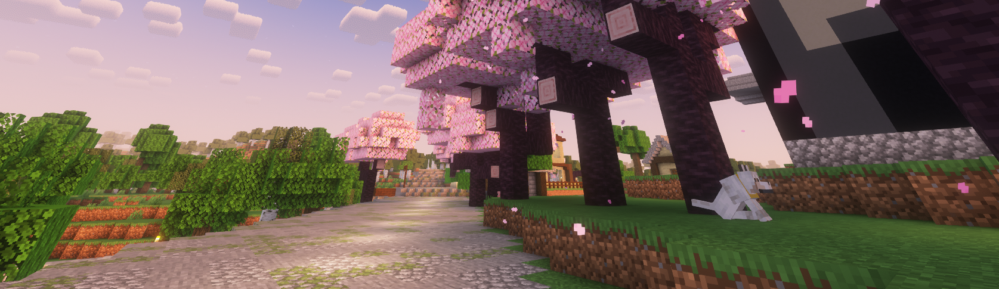

{.rounded}

# Покраска блоков одним кликом

## Как красить блоки?

Чтобы покрасить блок вам надо навести на него прицел и кликнуть правой кнопкой мыши.

А чтобы сбросить цвет блока надо нажать шифт и кликнуть по блоку правой кнопкой мыши.

### Список блоков которые можно красить

* Шерсть
* Ковёр
* Кровать
* Свечи
* Терракота
* Глазурованная керамика
* Стекло
* Стеклянная панель
* Шалкеры
* Бетон
* Сухой бетон
